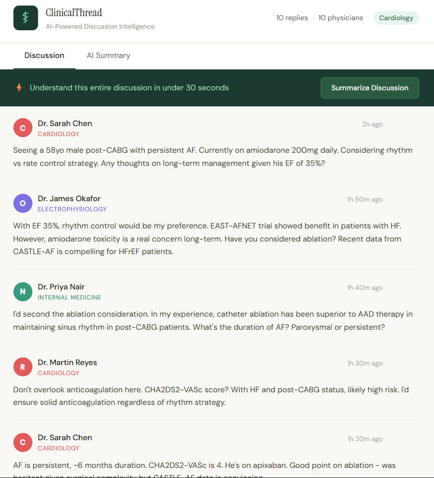
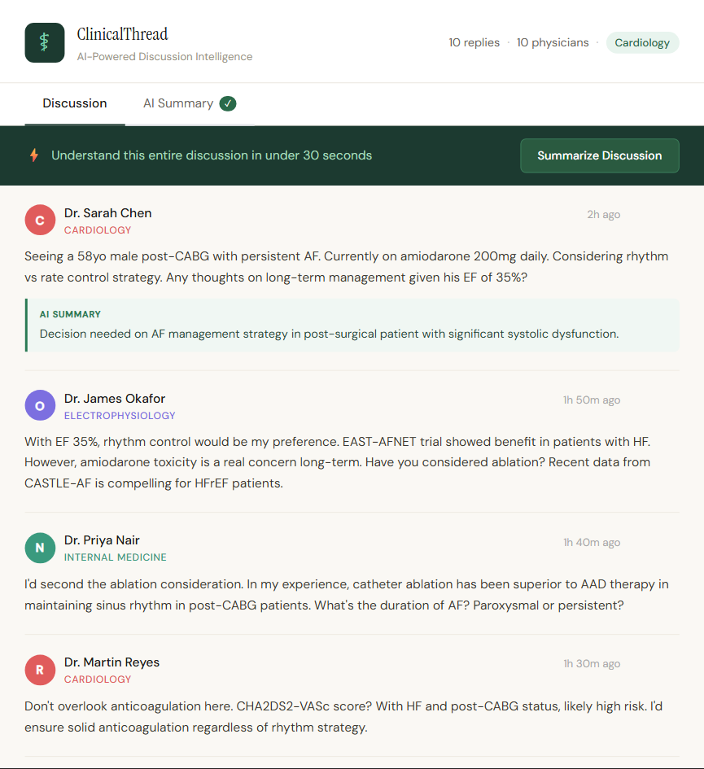
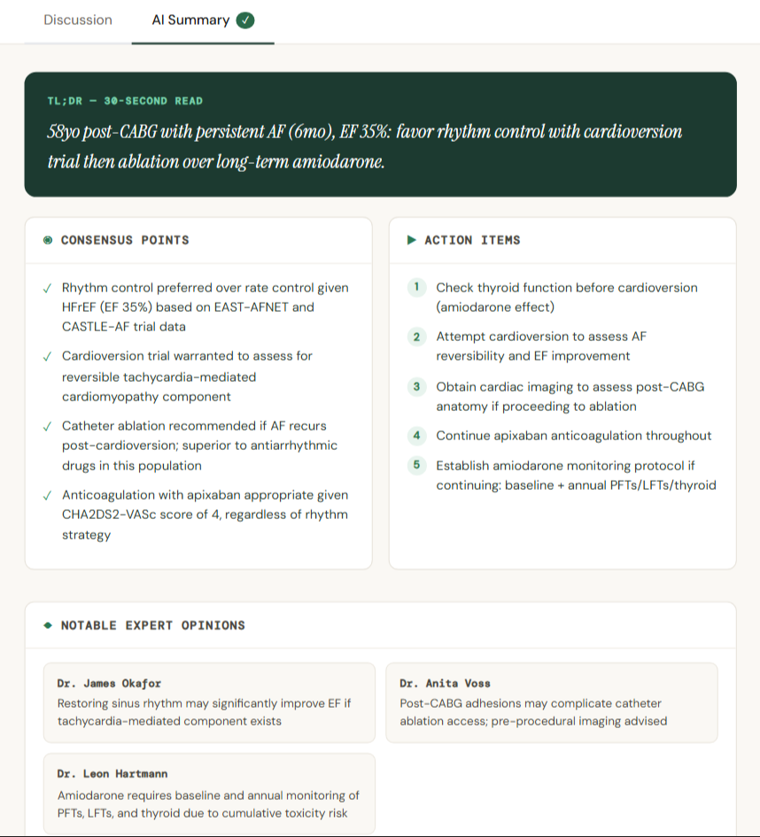

# Medical Summarizer
### AI-Powered Medical Discussion Summariser

> An AI feature that helps busy physicians cut through long medical discussion threads. Understand an entire clinical discussion in under 30 seconds.

Built with **React** and the **Anthropic Claude API**.

---

## The Problem

Medical discussion forums routinely generate 40–70 replies from physicians across different specialties. The most valuable insight is rarely the first reply — it might be a specialist's comment buried in reply 34, sitting between unrelated follow-ups, easy to miss, hard to find.

Doctors don't have 15 minutes to read an entire thread between patients. In most fields, missing a forum post means missing an opinion. In medicine, an overlooked comment from a specialist can directly affect patient care.

## The Solution

Two levels of AI summarisation:

- **Summarise Discussion** — one click turns the entire thread into a structured summary: TL;DR, consensus points, action items, and notable expert opinions
- **Per-comment TL;DR** — hover any comment to get a one-sentence summary of what that specific doctor is saying

---

## Tech Stack

- React
- Anthropic Claude API (`claude-3-5-sonnet`)
- Prompt engineering for structured JSON clinical output
- No backend — runs entirely in the browser (prototype)

---

## Getting Started

**1. Clone the repo**
```bash
git clone https://github.com/shreya-ree/medical-summarizer.git
cd medical-summarizer
```

**2. Install dependencies**
```bash
npm install
```

**3. Add your Anthropic API key**

Open `src/App.js`, find the `callClaude` function, and add your key to the headers:

```js
headers: {
  "Content-Type": "application/json",
  "x-api-key": "YOUR_CLAUDE_API_KEY_HERE",
  "anthropic-version": "2023-06-01",
  "anthropic-dangerous-direct-browser-access": "true",
},
```

Get your key from [console.anthropic.com](https://console.anthropic.com) → API Keys.

**4. Run the app**
```bash
npm start
```

Opens at `http://localhost:3000`

---

## How the AI Summarisation Works

The discussion is passed to Claude with a system prompt instructing it to respond in strict JSON. The UI parses this and renders each component distinctly.

**Full discussion:**
```json
{
  "tldr": "One sentence clinical bottom line",
  "consensus": ["Point 1", "Point 2"],
  "keyInsights": [{ "author": "Dr. Name", "insight": "brief insight" }],
  "actionItems": ["Action 1", "Action 2"]
}
```

**Single comment:**
```json
{
  "summary": "2-3 sentence summary",
  "keyPoint": "The single most important takeaway"
}
```

---

## Known Limitations

- API key is exposed client-side — a backend proxy is required for production
- Discussion data is hardcoded — free-text input for pasting real discussions is the next priority

## What's Next

- Free-text input to paste any discussion from any platform
- Specialty-aware weighting, relevant specialists flagged more prominently
- Confidence score based on how many physicians agreed
- Backend proxy to secure the API key
- Ensure no patient-identifiable information is ever sent to the model

---

## Screenshots

**Discussion view**



**Per-comment AI Summary**



**Full AI Summary**



---

> ⚠️ **Disclaimer:** This tool summarises peer discussions and does not provide medical advice. It is a productivity aid for licensed physicians, not a clinical decision support system. No patient data should be entered into this tool.
